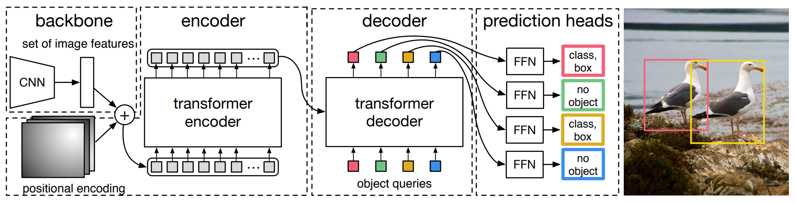
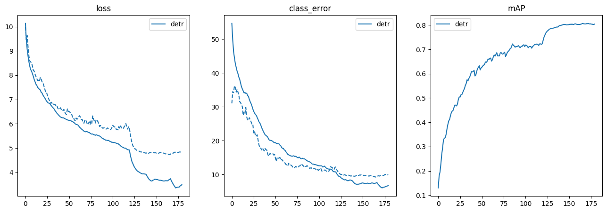
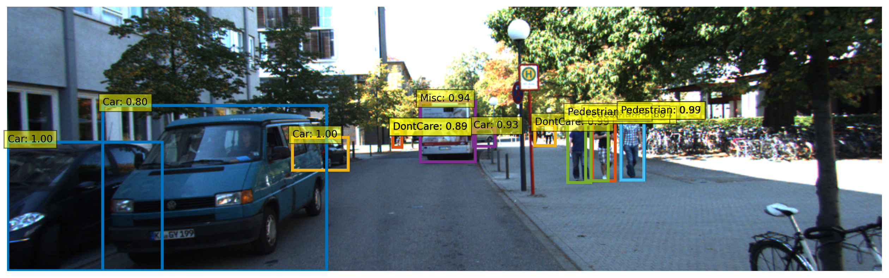
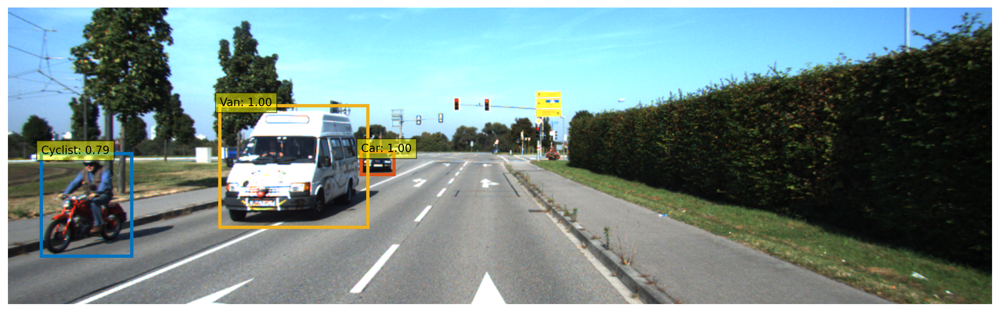
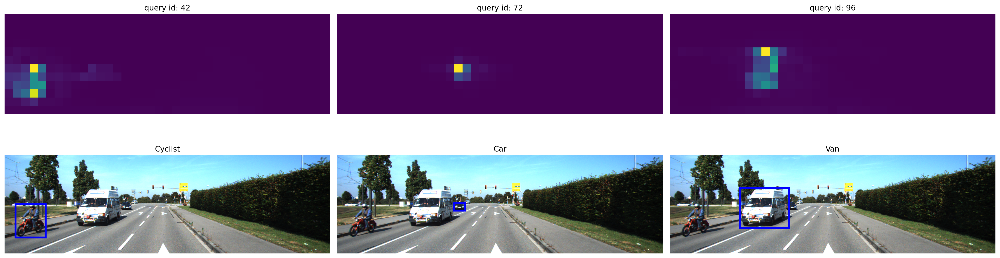

# 2D Object Detection using Transformer in Traffic Scene
- [2D Object Detection using Transformer in Traffic Scene](#2d-object-detection-using-transformer-in-traffic-scene)
  * [Problem Statement](#Problem-Statement)
  * [Data](#data)
  * [Evaluation Metrics](#evaluation-metrics)
  * [Model](#model)
  * [Training](#training)
  * [Visualization](#visualization)
  * [Notebooks](#notebooks)
---

## Problem Statement

---
This project aims to use a deep learning model to perform object detection tasks on images in realistic traffic Senses. 
The model should be able to classify and locate the objects in images, such as cars, vans, trucks, or pedestrians. 
End-to-end object detection with transformers (DETR), is a state-of-the-art object detector using a Transformer and a convolutional backbone. In this project,
We fine-tune a pre-trained DETR model on the KITTI dataset and evaluate its performance.

## Data

---

The training and test data are 6GB each (12GB in total). The data can be downloaded at [http://www.cvlibs.net/datasets/kitti/eval_object.php?obj_benchmark](http://www.cvlibs.net/datasets/kitti/eval_object.php?obj_benchmark) .The label data provided in the KITTI dataset corresponding to a particular image includes the following fields. We used an 80 / 20 split for train and validation sets respectively.

| Key | Values | Description |
| --- | --- | --- |
| type | 1 | String describing the type of object: [Car, Van, Truck, Pedestrian,Person_sitting, Cyclist, Tram, Misc or DontCare] |
| bbox | 4 | 2D bounding box of object in the image (0-based index): contains left, top, right, bottom pixel coordinates |

## Evaluation Metrics

---

We use mean average precision (mAP) as the performance metric here. **Average Precision:** It is the average precision over multiple IoU values. **mAP:** It is average of AP over all the object categories.

## Model

---

End-to-end object detection with transformers (DETR)  is a state-of-the-art object detector using a Transformer on top of a convolutional backbone. DETR consists of a convolutional backbone followed by an encoder-decoder Transformer which can be trained end-to-end for object detection. It greatly simplifies a lot of the complexity of models like Faster-R-CNN and Mask-R-CNN, which use things like region proposals, non-maximum suppression procedure and anchor generation. In this project, we aim to perform DETR on 2D object detection tasks in traffic scenes

## Training

---

We used a pre-trained DETR-ResNet-50 model, then fine-tuned on KITTI dataset. We trained the model with AdamW, setting the learning rate to 0.0001 and weight decay to 0.0001. We used a training schedule of 180 epochs with a learning rate drop by a factor of 10 after 120 epochs. We trained the model on the sharing GPU provided by Google CoLab, and it took five days. 

Our training record. Solid lines are training results. Dashed lines are validation results.

## Visualization

---

### Inference result on test images
Prediction results of DETR on **KITTI** test images are shown below.

### Encoder-Decoder attention weights visualization
Here we visualize attention weights of the last decoder layer. This corresponds to visualizing, for each detected objects, which part of the image the model was looking at to predict this specific bounding box and class.

### Inference result on raw data

--- 
## Notebooks
We provide a [tutorial.ipynb](tutorial.ipynb) to help you reproduce our experiment.